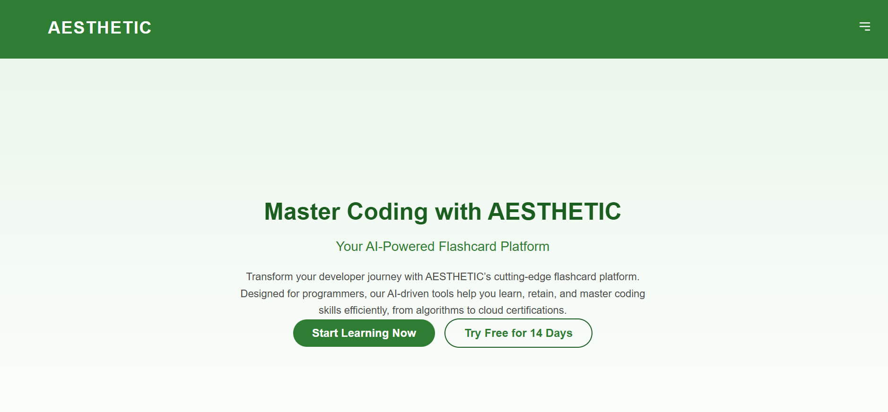

AESTHETIC - Flashcard Platform
AESTHETIC is a React-based landing page for a flashcard platform designed for developers to learn coding skills. It features a clean green-white design, responsive layout, and smooth animations.
Features
Screenshot

Home: Introduces the platform with a call-to-action.
Features: Highlights tools like spaced repetition and code snippet support.
About: Shares the platform’s mission and stats.
Pricing: Offers Free, Pro, and Team plans.
Contact: Includes a newsletter signup and social links.
Responsive design for mobile and desktop.
Animations for sections and hover effects.

Technologies

React
JavaScript
Inline CSS

Setup

Clone the Repository:
git clone https://github.com/mr-ahabib/React-landing-page-design.git
cd aesthetic-app

Install Dependencies:
npm install

Run the App:
npm start

Open http://localhost:3000 in your browser.

